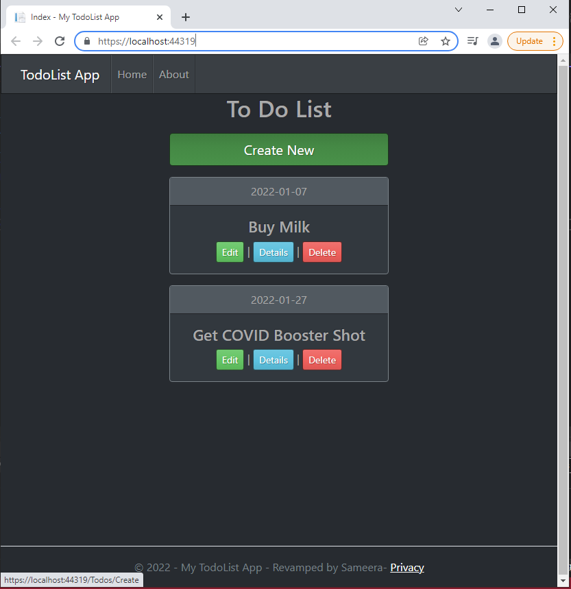
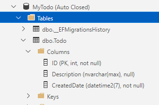

# DotNetCoreSQLDB
Sample Todo App with DotNetCore6 and SQL DB

This has a SQL Database Dependancy. The images below provides information about the database and the code below provides information on how to create the table. 





## SQL Table script

```SQL
SET ANSI_NULLS ON
GO
SET QUOTED_IDENTIFIER ON
GO
CREATE TABLE [dbo].[Todo](
	[ID] [int] IDENTITY(1,1) NOT NULL,
	[Description] [nvarchar](max) NULL,
	[CreatedDate] [datetime2](7) NOT NULL,
 CONSTRAINT [PK_Todo] PRIMARY KEY CLUSTERED 
(
	[ID] ASC
)WITH (PAD_INDEX = OFF, STATISTICS_NORECOMPUTE = OFF, IGNORE_DUP_KEY = OFF, ALLOW_ROW_LOCKS = ON, ALLOW_PAGE_LOCKS = ON) ON [PRIMARY]
) ON [PRIMARY] TEXTIMAGE_ON [PRIMARY]
GO

```